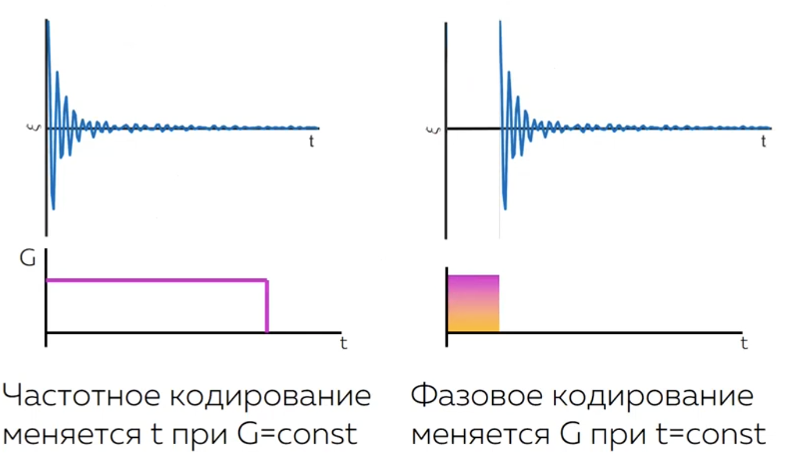
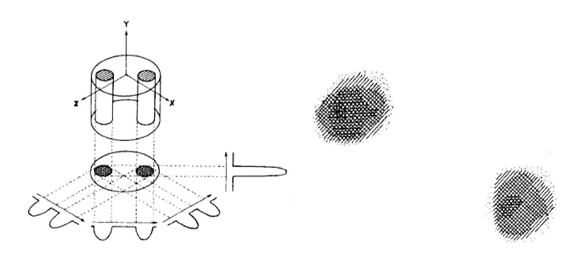
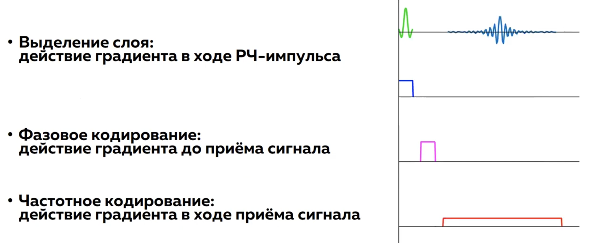
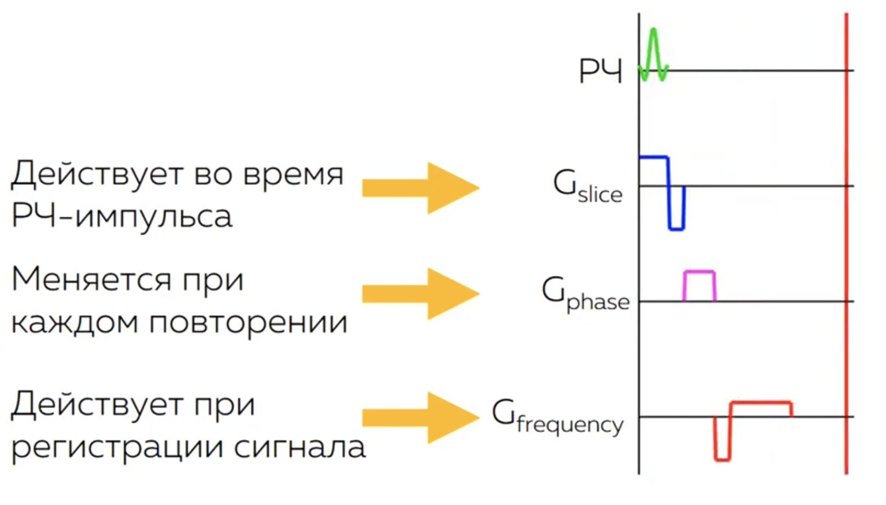
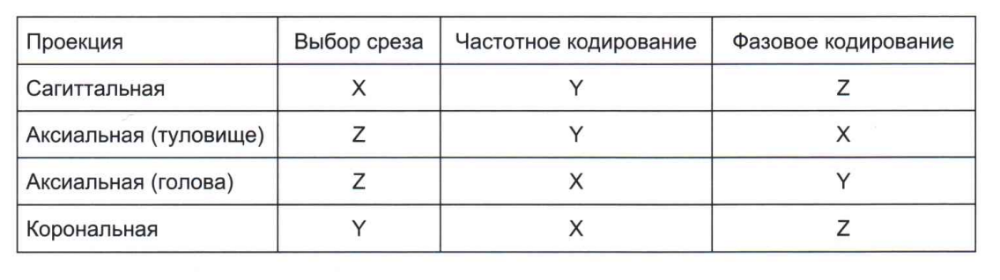

.. _encoding:

Пространственное и спектральное кодирование
============================================

В МРТ сигнал принимается со всего объема образца (например, головы пациента) одновременно. Без специальных механизмов мы получили 
бы лишь одну сумму всех сигналов, неспособную создать изображение. Для создания двумерного или трехмерного изображения необходимо закодировать 
позиционную информацию в принимаемом сигнале. Это достигается с помощью градиентных магнитных полей и манипуляций с частотой и фазой 
радиочастотных импульсов.

Для создания 2D-изображения используется трехэтапный процесс кодирования по трем осям: 
**выбор среза (Slice Selection), фазовое кодирование (Phase Encoding) и частотное кодирование (Frequency Encoding)**.

Градиентное магнитное поле создается с помощью встроенных в томограф градиентных катушек:
:math:`B = B_0 + (\vec{r} \cdot \vec{G})`,
где :math:`\vec{G}` — градиент поля.

Градиент делает магнитное поле а, следовательно, и резонансную частоту линейно зависящим от положения вдоль направления :math:`\vec{r}`:

.. math::
   \omega = \gamma(B_0 + (\vec{r} \cdot \vec{G}))

Выбор среза
------------
При однородном поле B₀ все протоны прецессируют с одной частотой. Чтобы возбудить только определенный срез, 
применяется магнитный градиент вдоль одной из осей (например, Z) **одновременно с РЧ-импульсом**.

РЧ-импульс имеет узкую полосу частот (bandwidth). Он будет возбуждать только те протоны, чья резонансная частота попадает в эту полосу.Таким образом, 
возбуждается не весь объем, а только тонкий срез, перпендикулярный оси градиента.

Толщина среза :math:`\Delta z` определяется амплитудой градиента :math:`G_z` и шириной полосы РЧ-импульса  :math:`\Delta f`:

.. math::
   \Delta z = \dfrac{2 \pi \Delta f}{\gamma G_z }

.. note:: 
   Для выделения слоя часто используются РЧ-импульсы типа :math:`\mathrm{sinc}(t)`, которые имеют прямоугольный спектр. 

   .. math::

      \int_{-\infty}^{\infty} \mathrm{sinc}(t) \, e^{-2\pi i f t} \, dt = \mathrm{rect}(f)
   
   В реальности РЧ-импульсы ограниченны во времени. Чем длиннее импульс, тем более тонкий слой мы можем получить. 

Получение распределения намагниченности из сигнала
---------------------------------------------------
Рассмотрим, как изменяется сигнал, если включить градиентное поле **после РЧ-импульса во время считывания сигнала**. Для этого подставим 
выражение для градиентного поля в уравнение Блоха. 

.. math::
   \begin{aligned}
   \vec{B} &= B_0 + (\vec{G} \cdot \vec{r}) \\
   \frac{d\vec{M}}{dt} &= \gamma \left[ \vec{M} \times \vec{B} \right]
   \end{aligned}

Решением уравнения является следующее выражение (избежать рассмотрения вращения намагниченности 
с частотой :math:`\omega_0` можно, если перейти во вращающуюся систему отсчета):

.. math::
   M_{\perp}(\vec{r}, t) = M(\vec{r}) e^{-i \gamma \int_0^t (\vec{G} \cdot \vec{r}) d\tau}

Сигнал, регистрируемый на катушке, -- интеграл по объему от намагниченности:

.. math::
   \xi(t) = \int M(\vec{r}) e^{-i \gamma \int_0^t (\vec{G} \cdot \vec{r}) d\tau} d\vec{r}

Сделав замену переменных :math:`\vec{k} = \gamma \int_0^t \vec{G}(\tau) \, d\tau`, получим:

.. math::
   \xi(k) = \int M(\vec{r}) \, e^{-i(\vec{k} \cdot \vec{r})} \, d\vec{r}

Полученное выражение представляет собой преобразование Фурье с парами :math:`(\vec{k}, \vec{r})`. Далее с помощью обратного преобразования Фурье можем получить
распределение намагниченности из сигнала:

.. math::
   \mathcal{F}\mathcal{T}[\xi(k)] = M(\vec{r})

.. math::
   M(\vec{r}) \approx \text{число протонов в точке с координатами } \vec{r}

k-пространство
---------------

Для осуществления пространственной локализации необходимо собрать данные о сигнале при различных значениях :math:`\vec{k}`.
Каждая точка в k-пространстве содержит информацию о пространственной частоте **всего изображения**.

Свойства:

 * Центр (k=0): Соответствует общей интенсивности сигнала (контрасту).

 * Периферия (высокие k): Соответствует мелким деталям и краям (разрешение).

Симметрия: K-пространство обладает свойством комплексной симметрии (сопряженной симметрии), что используется в методах частичного считывания.

Зависимость :math:`\vec{k}` от :math:`\vec{G}` и t
----------------------------------------------------

Как можно получить данные о сигнале при различных значениях :math:`\vec{k}`, чтобы заполнить k-пространство?

При прикладывании градиента вида рис. получаем следующее выражение для :math:`\vec{k}`:

.. math::
   k = \gamma \int_0^t \vec{G}(\tau) \, d\tau = \gamma G t.

Время :math:`t` меняется непрерывно, следовательно, мы можем получать различные значения :math:`\vec{k}`, просто оцифровывая сигнал во времени.
Второй переменной величиной является модуль градиента :math:`G`. Эти две переменные лежат в основе частотного и фазового кодирования :numref:`(Рис. %s) <_variation_k-figure>`. 

    Варианты варьирования значений вектора k

Частотное кодирование
----------------------

Частотное кодирование осуществляется за счет включения градиентного поля **после РЧ-импульса во время считывания сигнала**.

Во время чтения сигнала при включенном градиенте :math:`G_x` частота прецессии зависит от положения:

.. math::
   \omega(x) = \gamma (B_0 + x G_x).

При регистрации сигнала его величина на каждой частоте определяется количеством протонов, с такой резонансной частотой. 
Таким образом, применяя преобразование Фурье к регистрируемому сигналу, получаем спектр протонов в плоскости 
перпендикулярной плоскости градиента.   

Или, с точки зрения k-пространства, оцифровывая сигнал при приложенном :math:`G_x`, мы получаем 

.. math::
   \xi(k) = \int M(x) \, e^{-i \gamma k x} \, dr \text{  и  } M(x)

.. note:: 

   Можем получить изображение, используя только частотное кодирование. Подавая градиент в одном направлении после РЧ-сигнала,
   получаем проекцию спиновой плотности на выбранное направление. Повторяя сканирование много раз с различными направлениями 
   градиента и используя преобразование Радона, можем получить из проекций двумерное распределение плотности протонов 
   в объекте (аналогично с КТ) :numref:`(Рис. %s) <_Lauterbur-figure>`. 

    Lauterbur P. Image formation by induced local interactions. Nature 1973;242:190–191. (Нобелевская премия в области медицины 2003)   

Однако, если мы одновременно создадим два частотных градиента в двух разных направлениях, то получим кодирование только в одном направлении: представляющим собой векторную сумму направлений градиентов.

**Необходимо фазовое кодирование!**

Фазовое кодирование
--------------------
Фазовое кодирование осуществляется за счет включения градиентного поля **после РЧ-импульса до считывания сигнала.**

При включении градиента :math:`G_y` на время :math:`T_{pe}` фаза намагниченности в точке :math:`y` изменяется на:

.. math::

   \phi(y) = \gamma \int G_y(t) \, dt \cdot y = \gamma G_y T_{pe} y

Затем градиент фазового кодирования выключается и все протоны снова начинают вращаться с той же скоростью, но теперь у них есть разница фаз, продиктованная амплитудой градиента.
Чем больше разница фаз, тем меньший по амплитуде суммарный сигнал мы регистрируем, и наоборот.

Для заполнения k-пространства этот шаг повторяется много раз (например, 256 раз для матрицы 256x256) с разной амплитудой градиента :math:`G_y`.

    Схема кодирующей импульсной последовательности для заполнении одной строки в k-пространстве.

В реальности кодирующую импульсную последовательность дополняют рефазирующими градиентами :numref:`(Рис. %s) <_encoding_sequence2-figure>`.     

    Схема кодирующей импульсной последовательности для заполнении одной строки в k-пространстве с рефазирующими градиентами.

**Рефазирующий градиент**: После импульса необходимо применить градиент с противоположным знаком и площадью, равной половине площади 
градиента выборки среза, чтобы скомпенсировать фазовую дисперсию, накопленную во время импульса.    

Свойства k-пространства
------------------------

Заполнение центральных линий К-пространства происходит при использовании пологого градиента фазового кодирования, а внешние линии заполняются с участием крутого градиента.
При использовании малых по модулю фазовых градиентова, за счет минимизации фазовых сдвигов между протонами, возникающий сигнал имеет высокую амплитуду, и, в основном, 
определяет качество изображения и его контраст. Крутой градиент из-за больших фазовых сдвигов приводит к тому, что возникающий сигнал характеризуется низкой амплитудой
и не влияет на качество и контраст изображения. Большие сдвиги по фазе означают, что две точки, расположенные близко друг к другу в теле больного, вероятно, различаются по фазе, поэтому их
можно различить. 

Таким образом, внешние линии К-пространства, хотя не являются источниками сигналов, обеспечивают достаточное разрешение.
В то же время центральные линии, которые заполняются в результате небольших фазовых сдвигов, не обеспечивают необходимого разрешения,
поскольку маловероятно, чтобы в этом случае две близко расположенных точки имели различные фазовые сдвиги, поэтому эти точки неразличимы.

Свойства:

 * Центр (k=0): Соответствует общей интенсивности сигнала (контрасту).

 * Периферия (высокие k): Соответствует мелким деталям и краям (разрешение).

 * Симметрия: K-пространство обладает свойством комплексной симметрии (сопряженной симметрии), что используется в методах частичного считывания.
  
.. note::
   Описать альтернативные способы заполнения k-пространства.

Рекомендации по направлению частотного и фазового кодирования
--------------------------------------------------------------

Обычно, с помощью частотного кодирования локализуется сигнал вдоль длинной анатомической оси, с помощью фазового -- вдоль короткой.

Величина разрешения
-------------------

Шаг в пространственной области (разрешение) обратно пропорционален полной ширине k-пространства (Фурье-пары):

.. math::

   \Delta r = \frac{1}{k_{full}}

Т.к. вектор k пропорционален G, то лучшего разрешения можно добиться использованием более сильных градиентных катушек.   

Зависимость шума от величины вокселя
-------------------------------------
Получим выражение для отношения сигнал/шум. Разобьем поле зрения (FoV) на :math:`N` объёмов — вокселей в каждом направлении.

Сигнал от вокселя пропорционален его объёму:

.. math::

   \xi(x,y) \sim V_{voxel} = \Delta x \Delta y \Delta z

Шум в каждой точке k-пространства:

.. math::

   \sigma_k \sim 4kT \cdot R \cdot \Delta f_{receive}

После преобразования Фурье:

.. math::

   \sigma_{noise} = \frac{\sigma_k}{\sqrt{N}}   

Тогда отношение сигнал/шум для одного вокселя:

.. math::

   SNR_{voxel} \sim \frac{\Delta x \Delta y \Delta z}{\sqrt{\frac{\Delta f_{receive}}{N_{read} N_{phase}}}}

, где :math:`N_{read}` :math:`N_{phase}` - количество шагов по частотному и фазовому кодированию, соответственно.

Эта связь показывает, как параметры сканирования (размер вокселя, FoV, толщина слоя) влияют на качество изображения (SNR).

.. note:: 
   При увеличении разрешения уменьшается отношение сигнал/шум, следовательно падает качество изображения!

Метод перевыборки
------------------

Это же выражение можно переписать через время дискретизации :math:`\Delta t_s`:

.. math::
 
   SNR_{voxel} \sim \Delta x \Delta y \Delta z \cdot \sqrt{N_{read} N_{phase} \Delta t_s}

Полная ширина k-пространства в направлении частотного кодирования связана с количеством точек и временем оцифровки:

.. math::

   k_{full} \sim N_{read} \Delta t_s

.. note::

   Отношение сигнал/шум не зависит от шага в k-пространстве :math:`\Delta k_{read}`, а значит, не зависит и от поля зрения в этом направлении :math:`FoV_{read}`. SNR определяется только разрешением в направлении частотного кодирования.

   Это означает, что можно увеличивать :math:`FoV_{read}` без ущерба для SNR — это позволяет избежать артефактов наложения (aliasing) в направлении частотного кодирования.

