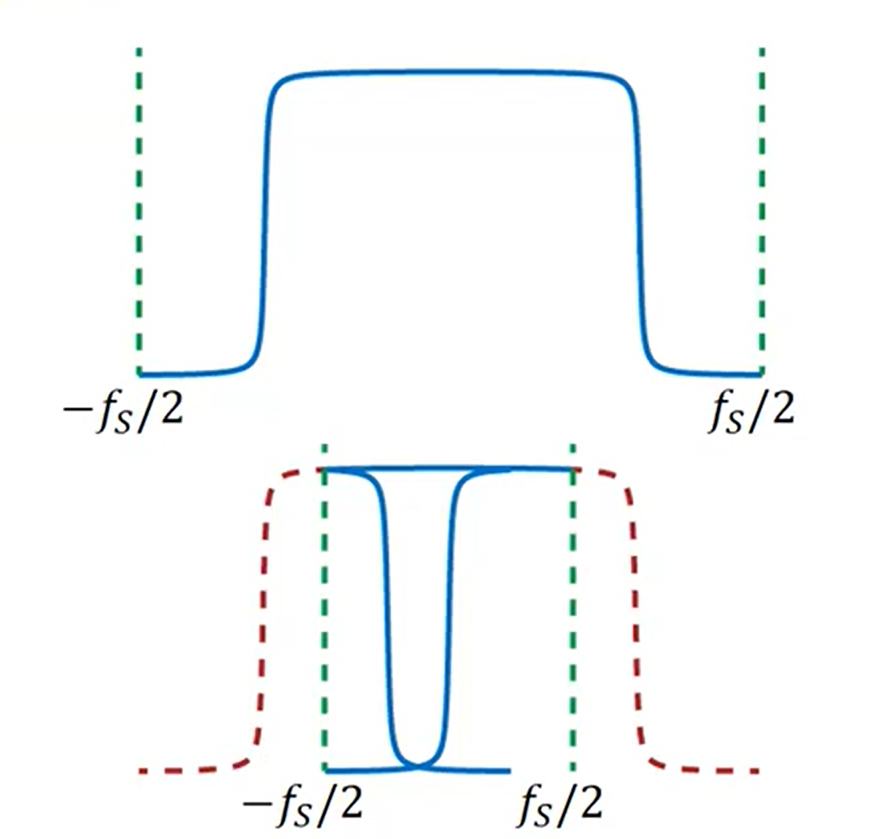
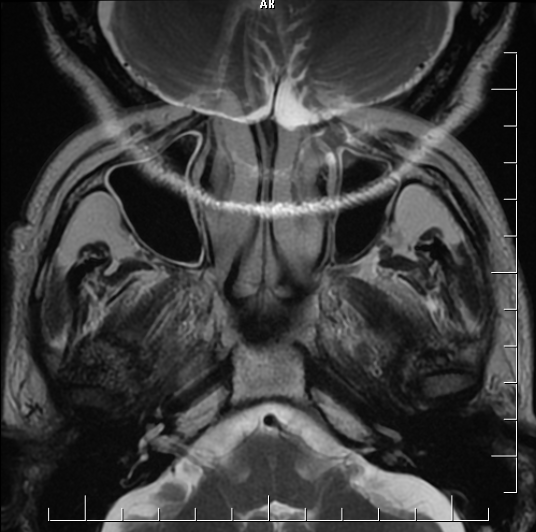

.. _reconstruction:

Сбор и реконструкция данных
==============================

Оцифровка сигнала
-----------------

Запись k-пространства ведется в цифровом виде, поэтому применима **теорема Котельникова**:

   Непрерывный сигнал с ограниченным спектром можно точно восстановить по его дискретным отсчётам, если они были взяты с частотой дискретизации, превышающей максимальную частоту сигнала минимум в два раза.

.. note::

   Частота оцифровки определяет полосу пропускания приёмника :numref:`(Рис. %s) <_Nyquist_theorem-figure>` :

   .. math::

      \Delta f_{receive} \text{ должна лежать в пределах от } -\frac{f_s}{2} \text{ до } \frac{f_s}{2} 

   В противном случае возникает артифакт наложения (aliasing artifact) :numref:`(Рис. %s) <_aliasing_artifact-figure>`. 

    Иллюстрация к теореме Котельникова

    
    Пример aliasing artifact

Чтобы этого избежать необходимо сопоставлять ширину поля обзора (FOV), которое мы хотим отсканировать, с частотой оцифровки.

Условие отсутствия наложения

  .. math::

     \frac{1}{\Delta t_s} = f_s = \Delta f_{receive} = \gamma G \cdot FoV

, где :math:`\Delta t_s` - период оцифровки.

С точки зрения k-пространства

  .. math::

     \Delta k = \gamma G \Delta t_s

  .. math::

     \Delta k = \gamma G \frac{1}{f_s} = \gamma G \frac{1}{\gamma G \cdot FoV} = \frac{1}{FoV}